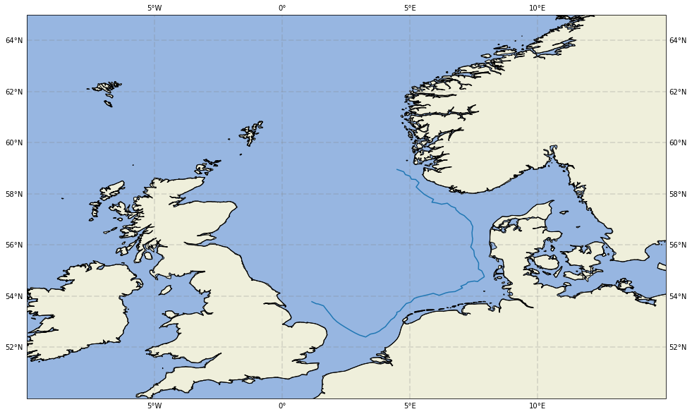
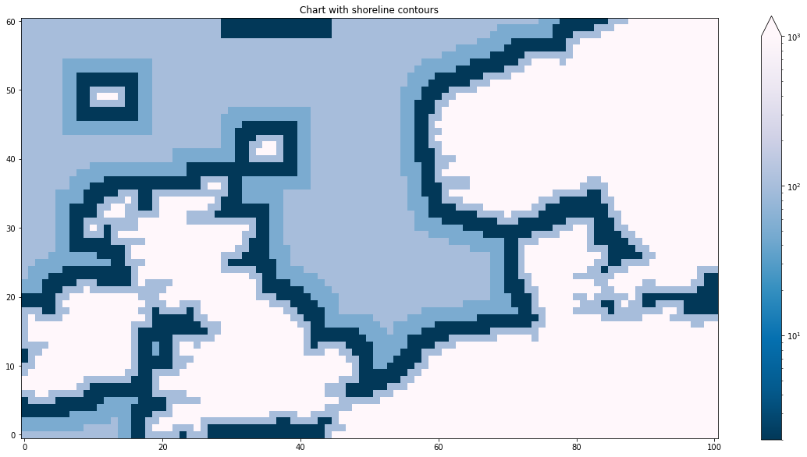

# Voyager ⛵
Voyager is a tool for agent-based simulation of seafaring, improving on the work by Montenegro A., at Ohio State University. 
The tool was developed at the Centre for Digital Humanities at the University of Gothenburg, with the objective of modelling ancient seafaring trajectories
in Bronze Age Europe, as well as ocean crossings in the migrative periods.

## Overview
Voyager is an agent-based simulation tool, simulating single agents representing sea vessels and their traversal of oceans due to a number of factors:
- Environmental factors: Data on sea currents and wind
- Empirical vessel factors: Data on experimental parameters of movement of common smaller crafts

The movement model and its equations of motion are based on these data as well as a path-finding algorithm for seeking targets and coastal hugging.

## Requirements
The required packages are listed in ``requirements.txt``;
```
pandas
numpy
pyyaml
xarray
opencv-python
geopy
scipy
dask
netcdf4
```
To use the tool, you also need data on winds and sea currents in netcdf format. The data directory should be structured in the following format:

```bash
├── winds
│   ├── 1998
│   └── 1999
        ├── 01.nc
        ├── 02.nc
        ├── 03.nc
        .
        .
        .
        └── 12.nc
    ...
└── currents
│   ├── 1998
│   └── 1999
        ├── 01.nc
        ├── 02.nc
        ├── 03.nc
        .
        .
        .
        └── 12.nc
    ...
```


## Installation
To install, download or clone the repository, follow these instructions:

1. Ensure you have a functional Python instance (``python>=3.6``) or have a virtual environment (like *venv* or *conda*) with Python activated.
2. Clone or download the repository, for example with

```bash
git clone https://github.com/waahlstrand/voyager
```
3. Install the package with
```bash
python setup.py install
```

## Demo script
To run the demonstration script you need to install the packages `cartopy` and `geopandas` as well. These have some binary dependencies that are easiest installed with [conda](https://docs.conda.io/en/latest/).

The demo generates two images illustrating a random sample trajectory in the North Sea, and the corresponding shorelines used for visualizing the pathfinding algorithm.





## Author
This package was implemented and designed by Victor Wåhlstrand Skärström, as part of the Centre for Digital Humanities at the University of Gothenburg.

## License
This package is licensed with the MIT License.